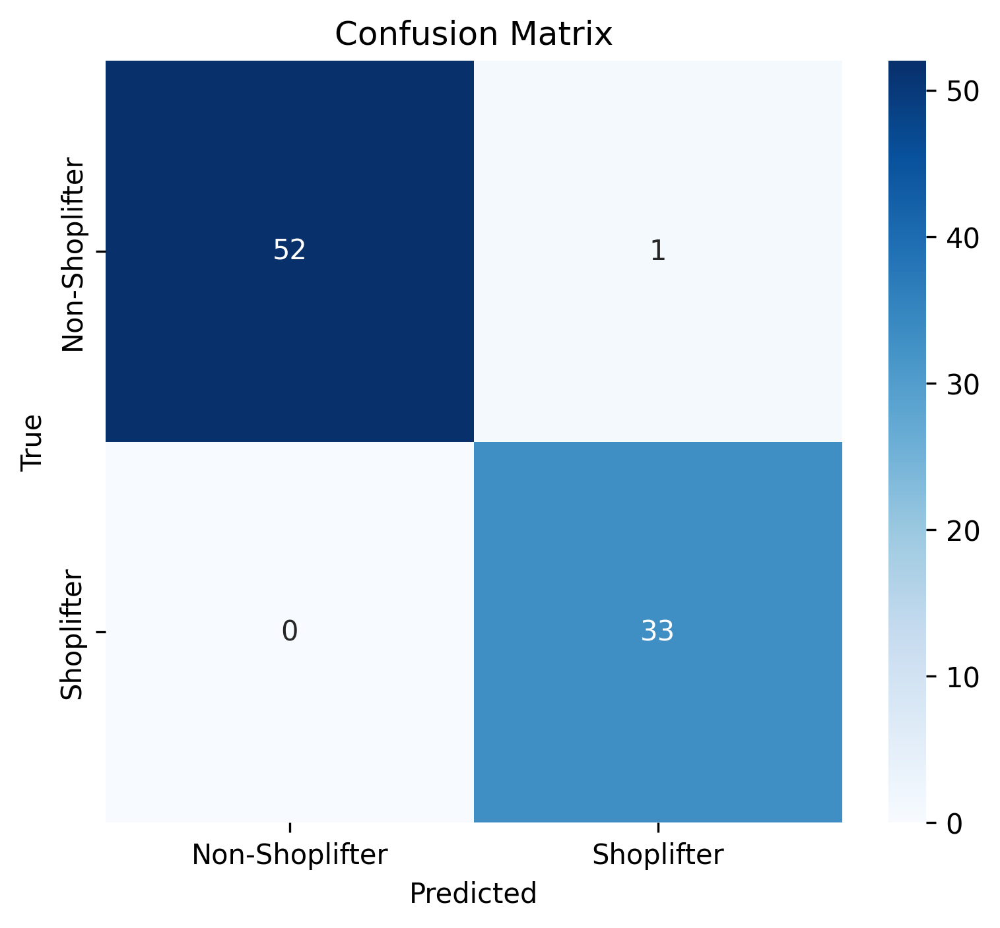
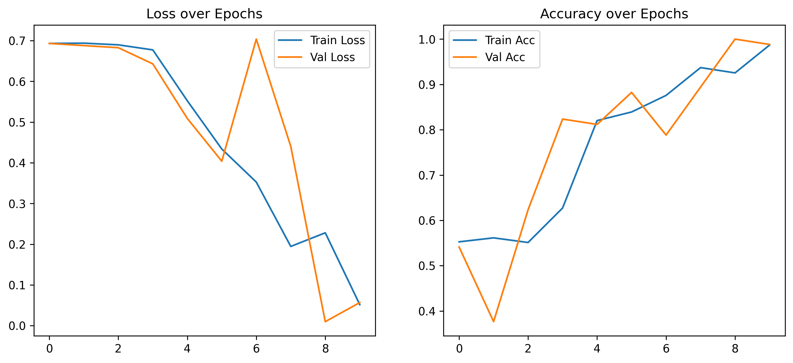

# Shoplifting Detection using CNN-LSTM

A deep learning-based video classification system for detecting shoplifting behavior in surveillance footage using a custom CNN-LSTM architecture built from scratch in PyTorch.

## 📋 Table of Contents
- [Overview](#overview)
- [Features](#features)
- [Architecture](#architecture)
- [Dataset](#dataset)
- [Repository Structure](#repository-structure)
- [Model Training](#model-training)
- [Model Performance](#model-performance)
- [Deployment](#deployment)
- [Requirements](#requirements)
- [License](#license)

---

## Overview

This project implements a video classification model that can automatically detect shoplifting behavior from surveillance camera footage. The model combines Convolutional Neural Networks (CNN) for spatial feature extraction and Long Short-Term Memory (LSTM) networks for temporal pattern recognition.

---

## Features

- **Custom CNN-LSTM Architecture**: Built from scratch without pretrained models
- **Pretrained Model Fine-tuning**: R3D-18 (3D ResNet) implementation for enhanced performance
- **Temporal Analysis**: Processes 16 uniformly sampled frames per video
- **Class Imbalance Handling**: Implements class weighting and balanced loss functions
- **Data Augmentation**: Random flips, rotations, and color jittering for better generalization
- **GPU Acceleration**: Full CUDA support for faster training
- **Django Deployment**: Production-ready web application for video upload and prediction

---

## Architecture

### Custom CNN-LSTM Model

The model consists of three main components:

#### 1. CNN Feature Extractor
- 4 convolutional blocks with batch normalization
- Progressive channel expansion (64 → 128 → 256 → 512)
- Max pooling for spatial dimension reduction
- Adaptive average pooling for flexible input sizes

#### 2. Bidirectional LSTM
- 2-layer bidirectional LSTM
- Hidden size: 256
- Captures temporal dependencies across video frames

#### 3. Classifier Head
- Fully connected layers with dropout (0.5)
- ReLU activation
- Binary classification output (Shoplifting vs Normal)

**Model Parameters**: ~15-20 million trainable parameters

### Pretrained R3D-18 Model

- 3D ResNet-18 architecture pretrained on Kinetics dataset
- Modified final layer for binary classification
- Dropout (0.5) for regularization
- Optimized for video understanding tasks

---

## Dataset

- **Classes**: 2 (Non-Shoplifter, Shoplifter)
- **Train/Val/Test Split**: 80/10/10
- **Class Distribution**: 
  - Non-Shoplifter: ~62%
  - Shoplifter: ~38%
- **Video Processing**: 16 frames per video, resized to 112×112 pixels
- **Stratified Splitting**: Maintains class balance across all splits

---

## Repository Structure

```
shoplifting-detection/
├── deployment/
│   └── shoplifting_detection/
│       ├── manage.py
│       ├── models/
│       │   └── best_3D_CNN_model.pth     # Trained model weights
│       ├── detector/
│       │   ├── forms.py                   # Video upload form
│       │   ├── model_utils.py             # Model loading & inference
│       │   ├── views.py                   # Django views
│       │   ├── urls.py                    # URL routing
│       │   └── templates/
│       │       └── detector/
│       │           └── index.html         # Web interface
│       ├── shoplifting_detection/
│       │   ├── settings.py
│       │   ├── urls.py
│       │   └── wsgi.py
│       └── requirements.txt
│
├── assets/
│   ├── confusion_matrix.png
│   └── training_curves.png
│
├── shoplifting-FromScratch.ipynb         # Train CNN-LSTM from scratch
├── shoplifting-PreTrained.ipynb          # Fine-tune pretrained R3D-18
└── README.md
```

---

## Model Training

### Option 1: Custom CNN-LSTM (From Scratch)

Located in `notebooks/custom_cnn_lstm_training.ipynb`

**Training Configuration:**
- Optimizer: Adam (lr=1e-3)
- Loss: Weighted Cross-Entropy
- Batch Size: 16
- Epochs: 10
- Data Augmentation: Random horizontal flip, rotation, color jitter

**Usage:**
```
# Load and run the notebook
# Trains a custom CNN-LSTM architecture from scratch
# Saves model as 'best_cnn_lstm_model.pth'
```

### Option 2: Fine-tuning Pretrained R3D-18

Located in `notebooks/r3d18_finetuning.ipynb`

**Key Features:**
- Uses pretrained weights from Kinetics-400 dataset
- Transfer learning for faster convergence
- Modified classification head for binary output

**Training Configuration:**
- Base Model: R3D-18 (3D ResNet)
- Optimizer: Adam (lr=1e-3)
- Batch Size: 16
- Epochs: 10
- Preprocessing: Uniform frame sampling, resize to 112×112

---

## Model Performance

### Confusion Matrix


### Training Curves


---

## Deployment

### Django Web Application

The project includes a Django-based web application for easy model deployment and inference.

**Features:**
- Upload surveillance videos through web interface
- Real-time prediction with confidence scores
- Displays probability distribution for both classes
- Video playback with prediction results

### Setup Instructions

1. **Navigate to deployment folder:**
```
cd deployment/shoplifting_detection
```

2. **Install dependencies:**
```
pip install -r requirements.txt
```

3. **Place your trained model:**
```
# Copy your .pth model file to:
models/best_3D_CNN_model.pth
```

4. **Run migrations:**
```
python manage.py migrate
```

5. **Start the server:**
```
python manage.py runserver
```

6. **Access the application:**
```
Open browser: http://127.0.0.1:8000/
```

### Deployment Architecture

**Model Loading:**
- Model loaded once at startup (global variable)
- Avoids redundant loading for each request
- Set to evaluation mode for inference

**Video Processing Pipeline:**
1. User uploads video via web form
2. Video saved temporarily to media folder
3. Extract 16 uniformly sampled frames
4. Preprocess frames (resize, normalize)
5. Run inference with loaded model
6. Return prediction with confidence scores
7. Display results on web interface

**Prediction Output:**
```
{
  "prediction": "Shoplifting" | "Normal",
  "confidence": 95.67,
  "probabilities": {
    "normal": 4.33,
    "shoplifting": 95.67
  }
}
```

---

## Requirements

### Training Requirements

```
torch>=1.9.0
torchvision>=0.10.0
opencv-python-headless>=4.5.0
numpy>=1.19.0
scikit-learn>=0.24.0
matplotlib>=3.3.0
seaborn>=0.11.0
tqdm>=4.60.0
```

### Deployment Requirements

```
Django==4.2.0
torch==2.0.0
torchvision==0.15.0
opencv-python==4.8.0.76
numpy==1.24.3
Pillow==10.0.0
```

---

## License

This project is licensed under the MIT License - see the [LICENSE](LICENSE) file for details.

---

## Acknowledgments

- R3D-18 architecture from torchvision.models.video
- Dataset: Shoplifting Videos Dataset
- Built with PyTorch and Django frameworks
